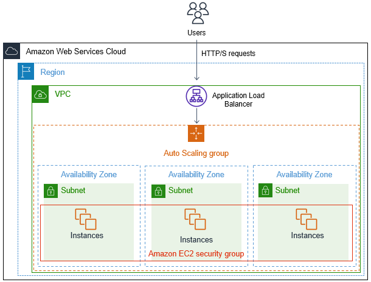
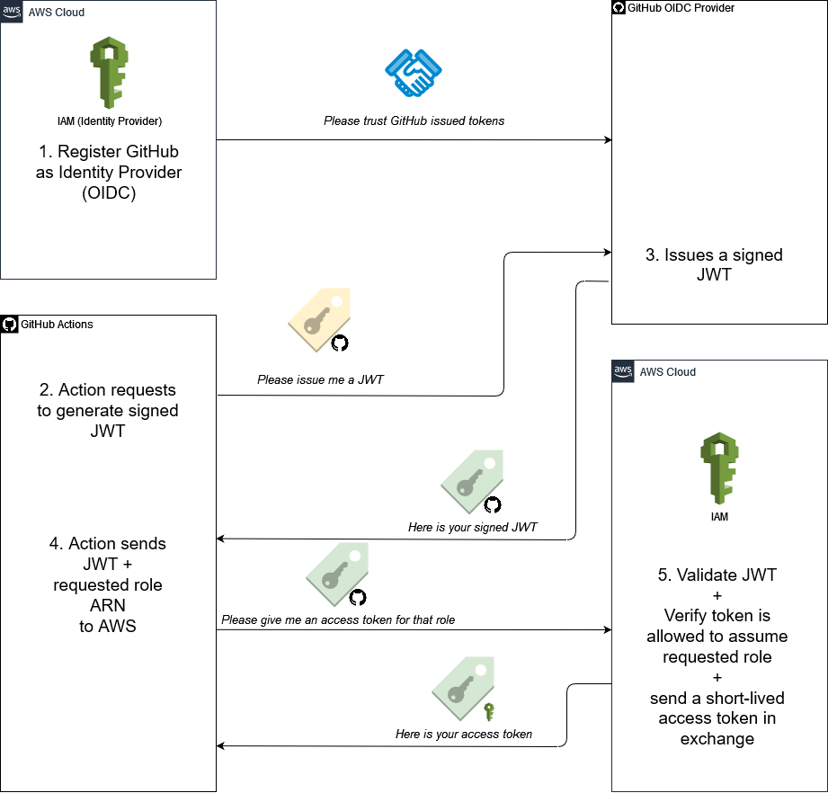
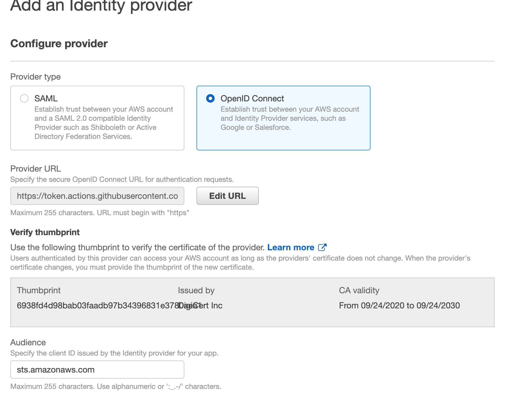
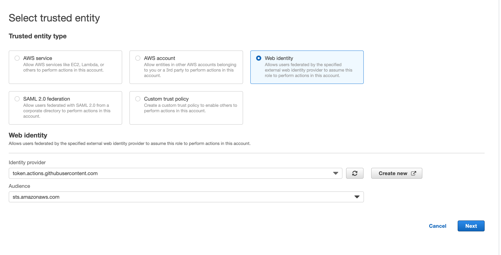
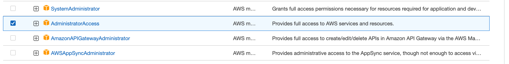
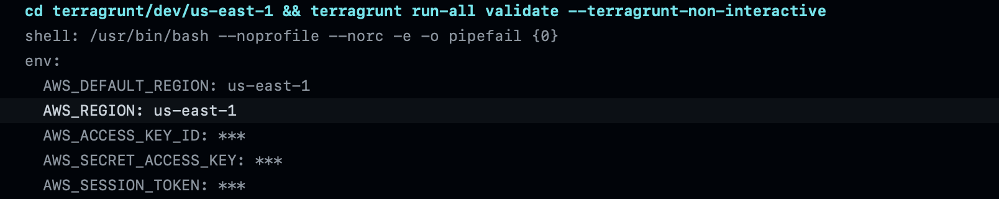

# Setup CI/CD workflow pipeline with multiple AWS regions & accounts using Terragrunt & Terraform

[](https://github.com/startuplcoud/infra-multi-account-region-startup-kit/actions/workflows/production-terragrunt.yaml)
[](https://github.com/startuplcoud/infra-multi-account-region-startup-kit/actions/workflows/production-terrascan.yaml)
[](https://github.com/startuplcoud/infra-multi-account-region-startup-kit/actions/workflows/production-tfsec.yaml)
[](https://github.com/startuplcoud/infra-multi-account-region-startup-kit/actions/workflows/production-checkov.yaml)

Set up AWS infrastructure with terragrunt and terraform in multiple accounts and regions demo kit.  
Goals:

1. Provisioning AWS infrastructure resources with terraform and terragrunt.
2. Support AWS with multiple accounts and regions.
3. Running the CI/CD workflow pipeline in parallel.
4. GitHub OIDC provider with AWS IAM role, no need to provide the AWS
   credentials.
5. Pattern: Separate terraform modules, keep the minimum AWS resources, avoid terraform state getting locked, and reduce duplicated codes.
6. Security solutions with vulnerability scan tools (tfsec, checkov, terrascan, etc.).
7. Store the secret values such as passwords in the git repository with SOPS.
8. AWS Infrastructure cost estimate preview with Infracost.

## AWS Services Architecture

This tutorial will show how to set up the AWS VPC, RDS, and EC2 Autoscaling group, with the application load balancer and how to use the terraform & terragrunt to manage the AWS infrastructure.

### The Auto Scaling & ALB Architecture Diagram



### Terraform layout

Create Terraform separate modules to manage AWS resources, do **NOT** manage terraform states in terraform modules, and try to separate the AWS resources into different modules, such as AWS VPC only
manage the AWS VPC resources.
Useful links about Google best practices for [terraform](https://cloud.google.com/docs/terraform/best-practices-for-terraform#minimize-resources).

This project terraform modules separate the AWS resources into four parts, VPC & Auto Scaling & RDS & Application Load Balancer.

```
infra
└── module
    ├── alb # application load balancer module
    │   ├── loadbalancer.tf
    │   ├── security.tf
    │   └── vars.tf
    ├── autoscale # autoscaling module
    │   ├── autoscale.tf
    │   ├── config
    │   │   └── init-config.yaml
    │   ├── data.tf
    │   ├── security.tf
    │   └── vars.tf
    ├── rds
    │   ├── main.tf
    │   ├── outputs.tf
    │   ├── security.tf
    │   └── vars.tf
    └── vpc # vpc module
        ├── data.tf
        ├── main.tf
        ├── outputs.tf
        └── vars.tf
```

### Terragrunt layout

Terragrunt is a thin wrapper around Terraform that provide remote state management, terraform modules dependencies, reduce
repetition and also support multiple AWS accounts and regions.

```
├── common # common configuration and input variables both can be used for the different aws account environment
│ ├── alb.hcl
│ ├── autoscale.hcl
│ ├── rds.hcl
│ └── vpc.hcl
├── dev # development account environment folder
│ └── us-east-1 # only provisioning AWS resources in us-east-1
│     ├── env.yaml global configuration parameters
│     ├── alb
│     │ └── terragrunt.hcl
│     ├── autoscale
│     │ └── terragrunt.hcl
│     ├── rds
│     │ └── terragrunt.hcl
│     └── vpc
│         └── terragrunt.hcl
├── prod
│ └── cn-north-1
│     ├── env.yaml
│     ├── alb
│     │ └── terragrunt.hcl
│     ├── autoscale
│     │ └── terragrunt.hcl
│     ├── rds
│     │ └── terragrunt.hcl
│     └── vpc
│         └── terragrunt.hcl
├── stage
│ └── ap-southeast-1
│     ├── env.yaml
│     ├── rds
│     │ └── terragrunt.hcl
│     └── vpc
│         └── terragrunt.hcl
├── secrets.global.yaml # sops generate secret values in global conguration
├── .sops.yaml # sops configuration
└── terragrunt.hcl # Global terragrunt configuration

```

### Global Variable and terragrunt auto generate for the global providers.

In the `env.yaml`, for the different region and accounts
we need to set the AWS account id and region variables or env common variables

#### Global env.yaml

```
aws_region: us-east-1
account_id: xxxxxxx
environment: dev
project: xxxx
```

#### terragrunt.hcl global

In the global terragrunt file, we can retrieve the `aws_region` and `account_id` in the `env.yaml`.

```hcl
locals {
  env_vars   = yamldecode(file("${find_in_parent_folders("env.yaml")}"))
  aws_region = local.env_vars["aws_region"]
  project    = local.env_vars["project"]
  account_id = local.env_vars["account_id"]
}
```

then, in the auto generate provider syntax, it will generate the `providers.tf` in each terraform module, and
the provider already strict the AWS region and account.

```hcl
generate "providers" {
  path      = "providers.tf"
  if_exists = "overwrite_terragrunt"
  contents  = <<EOF
provider "aws" {
  region = "${local.aws_region}"
  allowed_account_ids  = [ "${local.account_id}" ]
}
EOF
}
```

## Github OIDC with AWS IAM role.

Assume roles in AWS using an OpenID Connect identity provider.
In AWS, we can register GitHub action provider as an Identity Provider, and then the JWT generated
by GitHub action is allowed to access AWS account.


### Set up AWS IAM role & policies

#### Create OIDC Provider connection

In IAM → Identity providers → Add provider:



Provider URL: `https://token.actions.githubusercontent.com`

Global Region Audience:
`sts.amazonaws.com`    
China Region Audience:

`sts.cn-north-1.amazonaws.com.cn`(Beijing Region)           
`sts.cn-northwest-1.amazonaws.com.cn` (Ningxia Region)

#### Create AWS IAM role

Select Trust entity type, select the `Web identity`:

Add the `AdministratorAccess` permission


For policy also need to add the `"token.actions.githubusercontent.com:sub": "repo:{gituser}/{gitrepo}:ref:refs/heads/xxx"`,
`xxx` means the branch name in order to grant the boundary of the git repository.
AWS Global Region policy:

```json
{
  "Version": "2012-10-17",
  "Statement": [
    {
      "Effect": "Allow",
      "Principal": {
        "Federated": "arn:aws:iam::xxxxxxxx:oidc-provider/token.actions.githubusercontent.com"
      },
      "Action": "sts:AssumeRoleWithWebIdentity",
      "Condition": {
        "StringEquals": {
          "token.actions.githubusercontent.com:aud": "sts.amazonaws.com",
          "token.actions.githubusercontent.com:sub": [
            "repo:{gituser}/{gitrepo}:ref:refs/heads/xxx",
            "repo:{gituser}/{gitrepo}:pull_request"
          ]
        }
      }
    }
  ]
}
```

AWS China region policy:

```json
{
  "Version": "2012-10-17",
  "Statement": [
    {
      "Effect": "Allow",
      "Principal": {
        "Federated": "arn:aws-cn:iam::xxxxxxxx:oidc-provider/token.actions.githubusercontent.com"
      },
      "Action": "sts:AssumeRoleWithWebIdentity",
      "Condition": {
        "StringEquals": {
          "token.actions.githubusercontent.com:aud": [
            "sts.cn-north-1.amazonaws.com.cn",
            "sts.cn-northwest-1.amazonaws.com.cn"
          ],
          "token.actions.githubusercontent.com:sub": [
            "repo:{gituser}/{gitrepo}:ref:refs/heads/xxx",
            "repo:{gituser}/{gitrepo}:pull_request"
          ]
        }
      }
    }
  ]
}
```

#### GitHub Actions OIDC Auth to assume AWS Role

```yaml
- name: GitHub OIDC Auth to assume AWS Role
  uses: aws-actions/configure-aws-credentials@v1
  with:
    role-to-assume: arn:aws:iam::xxxxxx:role/xxxxx
    role-session-name: github-action
    aws-region: us-east-1
```

After the action executes, the `AWS_ACCESS_KEY_ID`, `AWS_SECRET_ACCESS_KEY` and `AWS_SESSION_TOKEN` will automatically register in the github action global environment.



## Run CI/CD pipeline in parallel

How to use the GitHub action `strategy.matrix` to significantly reduce the time on GitHub workflows.
`strategy.matrix` syntax allows creating multiple jobs by performing variable substitution in a single job definition.
Check the useful links for more details about the [GitHub Job Matrix](https://docs.github.com/cn/actions/using-jobs/using-a-matrix-for-your-jobs).

```yaml
strategy:
  matrix:
    include:
      - env-dir: dev # the terragrunt dev folder
        aws-region: us-east-1
        aws-account-id: xxxxxxx
        aws-role: xxxxxx
        aws: aws # aws_partition 
      - env-dir: prod
        aws-region: cn-north-1
        aws-account-id: xxxxx
        aws-role: xxxx
        aws: aws-cn
      - env-dir: prod
        aws-region: cn-northwest-1
        aws-account-id: xxxxx
        aws-role: xxxx
        aws: aws-cn # aws_partition 
```

For parameters combinations will result in 3 jobs:

1. `{env-dir: dev, aws-region: us-east-1, aws-account-id: xxxxx, aws-role: xxxx, aws: aws}`
2. `{env-dir: prod, aws-region: cn-north-1, aws-account-id: xxxxx, aws-role: xxxx, aws: aws-cn}`
3. `{env-dir: prod, aws-region: cn-northwest-1, aws-account-id: xxxxx, aws-role: xxxx, aws: aws-cn}`
   then the job will dynamically fill the `matrix` values in the `with` sections.

```yaml
 steps:
   - name: Checkout repo
     uses: actions/checkout@v3
   - name: terragrunt packages
     uses: ./.github/action/terragrunt-action
     with:
       role-to-assume: arn:${{ matrix.aws }}:iam::${{ matrix.aws-account-id }}:role/${{ matrix.aws-role }}
       role-session-name: github-action
       aws-region: ${{ matrix.aws-region }}
       env: ${{ matrix.env-dir }}
```

## Terragrunt best practices

1. Using multiple `include` blocks to DRY common terragrunt configuration to reduce duplicated code.
2. Using deep merge to DRY nested attributes.
3. Using expose includes overriding common configuration variables.
4. Reducing duplicated code blocks such as `inputs` or `dependency` for each terragrunt module.

```hcl
include "common" {
  path   = "${dirname(find_in_parent_folders())}/common/alb.hcl"
  expose = true
}
```

## EC2 instance cloud-init UserData setup With Terragrunt
If we want to pass the `cloud init` as the userdata variable, what's an easier way to resolve it.
We can use the terragrunt `before_hook` copy the new `cloud init` file in the terragrunt directory.
Create a new `init.yaml` in the terragrunt submodule directory, then copy the new `init.yaml` file to replace  
terraform original one.
```hcl
terraform {
  source = "../../../..//infra/module/autoscale"
  extra_arguments "common_vars" {
    commands = get_terraform_commands_that_need_vars()
  }
  before_hook "cloud-init" {
    commands  = ["apply","plan"]
    execute =   ["cp", "${get_original_terragrunt_dir()}/config/init.yaml",  "./config/init.yaml"]
    run_on_error = false
  }
}
```


### apply module

```shell
terragrunt run-all plan --terragrunt-include-dir $(directory)
```

### destroy module

```shell
terragrunt run-all destroy --terragrunt-working-dir $(directory)
```

### unlock module

What if terraform module get locked by accidentally.

```
Error: Error locking state: Error acquiring the state lock: ConditionalCheckFailedException: The conditional request failed
Lock Info:
ID:        9db590f1-b6fe-c5f2-2678-8804f089deba
Path:      ...
Operation: OperationTypePlan
Who:       ...
Version:   0.12.25
Created:   2020-05-29 12:52:25.690864752 +0000 UTC
Info:      
Terraform acquires a state lock to protect the state from being written
by multiple users at the same time. Please resolve the issue above and try
again. For most commands, you can disable locking with the "-lock=false"
flag, but this is not recommended.
```

unlock the module: directory is the path of the lock module. `lock_id` should be 
the Lock Info `ID`.
```bash 
cd terragrunt/$(directory) && terragrunt force-unlock $(lock_id)
```


## Security Tips

### Encrypt terraform states in S3 bucket and Dynamodb

terragrunt encrypt the tfstate in the remote s3 bucket and Dynamodb.

```hcl
remote_state {
  backend  = "s3"
  generate = {
    path      = "backend.tf"
    if_exists = "overwrite_terragrunt"
  }
  config = {
    bucket         = "${local.project}-terraform-state-${local.aws_region}"
    key            = "${path_relative_to_include()}/terraform.tfstate"
    region         = local.aws_region
    encrypt        = true
    dynamodb_table = "${local.project}-terraform-lock-table"
  }
}
```

### Store the sensitive values in the git repository with SPOS

#### install SOPS and gnupg

    brew install sops gnupg

#### PGP fingerprint setup in local (NOT recommended)

PGP will remove in future version. https://github.com/mozilla/sops/issues/727

issue may have: https://github.com/mozilla/sops/issues/304
need to append in the .bashrc

    GPG_TTY=$(tty)
    export GPG_TTY

input the `real name` and `email` and `password` with the commands:
`gpg --gen-key`

```
pub   ed25519 2022-07-18 [SC] [expires：2024-07-17]
      01D0D800C76AC893E74990B44BB1CE513349E336 (fingerprint key)
uid                      winton <365504029@qq.com>
sub   cv25519 2022-07-18 [E] [expires：2024-07-17]
```

### create secret key with SOPS  (NOT recommended)

    sops -pgp 01D0D800C76AC893E74990B44BB1CE513349E336 ./secrets.yaml

Edit in the YAML file set the db_password like this and save it to local file `secrets.yaml`:

```yaml
db_password: xxxxxx
```

Generator YAML file with SOPS.

```yaml
    db_password: ENC[AES256_GCM,data:Glso+g==,iv:xa1LZUNbVg1Mno9x7ywXz2U2PFleoEr3q8ZO6G3BuVo=,tag:Mw2xjSieVsP49qFYnlcsKQ==,type:str]
    sops:
      kms: [ ]
      gcp_kms: [ ]
      azure_kv: [ ]
      hc_vault: [ ]
      age: [ ]
      lastmodified: "2022-07-18T08:33:15Z"
      mac: ENC[AES256_GCM,data:kyWGR+oO6KOvZj6AcLBQca04dhtN4fD+W2sz2X6U+rKe21hBzF8SldsHSgZJcK3L+zmHduFYK8yAbnCXlp/n9wFOzEiC+LrsQJZ2MKUTwLdSsRuz8eFJxChcGPu+2bcduiHb/oQDOIhfwnNy9T8SOfcGC13SaAGJu3n7GCIi7jU=,iv:GFRaLFdVQYm3uyvrtxo/dzZzXSmpzRjidFPuDvi7tkE=,tag:pqGgFOEgHBIAQRz7ZXCPqA==,type:str]
      pgp:
        - created_at: "2022-07-18T08:32:33Z"
          enc: |
            -----BEGIN PGP MESSAGE-----

            hF4DD+gJKRAEVSYSAQdA6uH391JK8rksm63xardQcwATT5nrC9mz7N3cafJQ/xkw
            zqHX1L1jEy40N1wh/PjYgf8f1c46jLfeTQqGSn3tdxLo2eIaV86/jOqp4e2yO2FK
            1GgBCQIQa1dBfCd873wIsj86KfUUX5rEXainUegvT+JF0QkPVZ4PgC7HFbAOtG07
            izdEf+5k5qj6Z3dy7Z3r2M6bVp7te+BYXt56yohCDqVqxsWDcis6pfCWD61w56+8
            PtJqcXGFNfTKmg==
            =XdTX
            -----END PGP MESSAGE-----
          fp: 01D0D800C76AC893E74990B44BB1CE513349E336
      unencrypted_suffix: _unencrypted
      version: 3.7.3
```

Decrypt the secrets.yaml with terragrunt

```hcl
# database config read the password from local secrets
locals {
  environment = "development"
  secrets     = yamldecode(sops_decrypt_file("${dirname(find_in_parent_folders())}/secrets.yaml"))
  db_password = local.secrets["db_password"]
}
```

Apply or plan the rds module, we must provide the gpg password to retrieve the encrypted yaml.

### set up the AWS IAM role and PGP

1. Create a KMS key using the SOPS to encrypt & decrypt the sensitive values.
2. For multiple regions take effects need to enable the multiple region option.
3. For multiple accounts, editor the KMS key policy to allow other account IAM roles to have the corresponding permission to access the key.
4. To avoid if the AWS KMS key is broken, also need use the GPG to rotate the key.
5. For different env (accounts) or regions (AWS China or global region), create the SOPS rules `.sops.yaml` to generate different environment configuration.
7. Make sure the GitHub action IAM role and user role have the permission to encrypt or decrypt with the KMS key.

#### apply terragrunt module to generate AWS KMS key

Using terraform and terragrunt to create KMS key to generate the SOPS secret credentials.
If we want to use a single KMS key that can be encrypted in multiple accounts, add the other AWS account IAM role arn
or user arn as the terraform input values.

terragunt role arn list and user arn list

```hcl
role_arn_list = [
  "arn:aws:iam::594962198840:role/terragrunt"
]
user_arn_list = [
  "arn:aws:iam::733051034790:user/admin"
]
```

Apply the kms_sops module to get the `kms_arn` output value, then create the `.sops.yaml` rules templates.

```shell
make apply-module directory=kms-global/us-east-1 module=kms_sops
```

Copy the GPG value with this command `gpg --fingerprint 365504029@qq.com`

    pub   ed25519 2022-07-18 [SC] [expires：2024-07-17]
          01D0 D800 C76A C893 E749  90B4 4BB1 CE51 3349 E336
    uid             [ uid ] winton <365504029@qq.com>
    sub   cv25519 2022-07-18 [E] [expires：2024-07-17]

#### create `.sops.yaml` rules with KMS key & PGP

```yaml
creation_rules:
  - path_regex: \.global\.yaml$
    # aws kms key global region
    kms: 'arn:aws:kms:us-east-1:733051034790:key/mrk-222444666c2f4b62ad5066365e84aeb8'
    pgp: '01D0D800C76AC893E74990B44BB1CE513349E336'

    # aws china region
  - path_regex: \.china\.yaml$
    kms: 'arn:aws-cn:kms:cn-northwest-1:733051034790:key/mrk-f24f28b41b0d49419df429946e774safd'
    pgp: '01D0D800C76AC893E74990B44BB1CE513349E336'

```

#### generate secrets.global.yaml

Create file name extension must match the regex pattern `.global.yaml`

```shell
AWS_PROFILE=terragrunt sops secrets.global.yaml
```

edit the secret values in the yaml file:

```yaml
dev: # for the aws dev account 
  db_password: xxxxxx
#stage: # for aws stage account
#  db_password: xxxxxx
```

comment the `aws_profile` in the generated YAML file.

```yaml
dev:
  db_password: ENC[AES256_GCM,data:kmtaxwBA,iv:FelpjBTuPMwfE2IueHh7fWxrHcKwGZf15oar9JeDpsA=,tag:wmkIHhAiUkH1iseqF7R0vw==,type:int]
sops:
  kms:
    - arn: arn:aws:kms:us-east-1:733051034790:key/mrk-222444666c2f4b62ad5066365e84aeb8
      created_at: "2022-07-19T15:52:49Z"
      enc: AQICAHgDKXq49C3kkzpf84wGoN9nR2bnic4C850M0a1Q6F7ZywHwFjdqpxJAFhhcwrNaDC3QAAAAfjB8BgkqhkiG9w0BBwagbzBtAgEAMGgGCSqGSIb3DQEHATAeBglghkgBZQMEAS4wEQQMTCX5INMF7egCoTKZAgEQgDtCO7U4BfdrVZMFxJdvjq3BRoHLgWceFaLCQPxwdbVmMmyWe9R2WFvfAX48MVEvBIP69fdsstn2UMSFUQ==
      # aws_profile: terragrunt # disable 
  gcp_kms: [ ]
  azure_kv: [ ]
  hc_vault: [ ]
  age: [ ]
  lastmodified: "2022-07-19T15:53:18Z"
  mac: ENC[AES256_GCM,data:fGOwBKVLCuOOJpyIWMAdZYLVYq4XP1mmfQgnabsKa6qB1o3Zke5q3lW+QSXBjOMMWqnM4TTNMYrJIuxqVoKKo9Jsm+Syq7PUrcLvzE+VcvrlySwpTgXikzczqryHzjvFQHGI+j7uV7Sw5p+8/gozCQ7ay1hfmmHgCeQekBRCjo4=,iv:/tVYsiXabhdtuItkPGbZOYkFuifEdgKEZxpOz5lxucY=,tag:LH0aWW4OjRIz7rFfZuIiww==,type:str]
  pgp:
    - created_at: "2022-07-19T15:52:49Z"
      enc: |
        -----BEGIN PGP MESSAGE-----

        hF4DD+gJKRAEVSYSAQdAgm5i6ZNi5K59CTVo6bbawyhJnISJ7oESN7DVP8k2RR8w
        r4ga9LnNwGDHlL8it8IVaoYgaBjGB/vOJG0vrlzUH/fvfz2N1rumylVcMKSqEdjm
        1GgBCQIQ3IIepfyi7mme9PvDs8lEn1bb4IbGUEoubRBmtkE/vC5IHBuveAANsAUK
        hfqWs7mGDgoWD0jrusNuYQON9cyvy1xkikBeSlayibuYPYqcsDHd+pGCzSUpjZSH
        m1AzxfgAUUULow==
        =MVSz
        -----END PGP MESSAGE-----
      fp: 01D0D800C76AC893E74990B44BB1CE513349E336
  unencrypted_suffix: _unencrypted
  version: 3.7.3
```

#### Retrieve the `db_password` value with terragrunt.

```hcl
locals {
  environment = "development"
  secrets     = yamldecode(sops_decrypt_file("${dirname(find_in_parent_folders())}/secrets.global.yaml"))["dev"]
  db_password = local.secrets["db_password"]
}
```

### Terraform code Vulnerability scan tools

Vulnerability tools:

1. [tfsec](https://github.com/aquasecurity/tfsec)
2. [terrascan](https://github.com/tenable/terrascan)
3. [checkov](https://github.com/bridgecrewio/checkov)

In the pull request GitHub action, after analyzing terraform code,
the analysis result will automatically upload to the Github security adviser.

## AWS Resources Cost Preview in the Pull Request

Cost estimates with [Infracost](https://www.infracost.io/).

How to estimate the AWS resources will spend for a month, use the Infracost to generate the total summary of the AWS resources.
Directly check this Pull Request,
https://github.com/startuplcoud/infra-multi-account-region-startup-kit/pull/5

## Contact

If you have any questions, please contact with the email contact@startupcloud.tech


